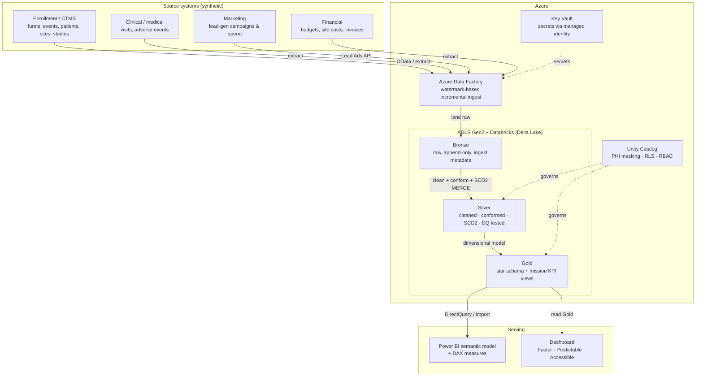

# Decentralized Trials BI Platform

An end-to-end data engineering and BI platform for a decentralized clinical research
organization, **built around one mission: making clinical trials faster, more predictable, and
more accessible.** Every layer of this platform exists to serve those three goals, and the Gold
marts and dashboard are organized by them.

The platform ingests the four data domains a decentralized research org actually runs on —
enrollment/recruitment, clinical/medical, marketing, and financial — lands them in an Azure Data
Lake, builds a medallion (Bronze → Silver → Gold) model in Databricks with SQL, governs PHI with
Unity Catalog, and serves leadership KPIs through a Power BI semantic model and a runnable
dashboard.

> Stack: **Azure** (ADLS Gen2, Data Factory, Key Vault, Databricks) · **Databricks + Delta Lake** ·
> **SQL-first transformations** · **Python** (ingestion + synthetic data) · **Bicep** IaC ·
> **Power BI** + a local dashboard · **GitHub Actions** CI.

---

## Table of contents

1. [How the platform serves the mission](#how-the-platform-serves-the-mission)
2. [Architecture](#architecture)
3. [Quick start (local mode — no Azure)](#quick-start-local-mode--no-azure-required)
4. [Deploy to Azure](#deploy-to-azure-real-subscription)
5. [End-to-end data walkthrough (manual, step by step)](#end-to-end-data-walkthrough-manual-step-by-step)
6. [Tracing the path of the data with SQL](#tracing-the-path-of-the-data-with-sql)
7. [Repository layout](#repository-layout)
8. [Troubleshooting](#troubleshooting)
9. [Cost & teardown](#cost--teardown)

---

## How the platform serves the mission

The Gold layer is split into three KPI domains that map one-to-one to the business goals:

| Mission goal | What the data answers | Gold KPI views |
|---|---|---|
| **Faster** | Where is time lost between first contact and an enrolled patient? | `kpi_speed_*` — enrollment velocity, time-to-first-patient, stage-to-stage cycle times, site activation lag |
| **More predictable** | Will this study hit its enrollment target, and when? | `kpi_predictability_*` — run-rate enrollment forecast, projected completion vs. target, funnel-conversion stability, at-risk flags |
| **More accessible** | Are we reaching more — and more representative — patients and communities? | `kpi_accessibility_*` — diversity/representation of enrolled patients, decentralized (community/mobile) reach, geographic spread |

A reviewer can run the whole thing locally with no Azure subscription and see these three views
populated end to end.

---

## Architecture



**New here for a review?** Start with [`PORTFOLIO.md`](PORTFOLIO.md) — the design decisions and why.

See [`docs/architecture.md`](docs/architecture.md) for layer-by-layer detail and
[`docs/lineage.md`](docs/lineage.md) for column lineage.

---

## Quick start (local mode — no Azure required)

```bash
python -m venv .venv && source .venv/bin/activate
pip install -r requirements.txt

make demo        # generate synthetic data -> Bronze -> Silver -> Gold -> launch dashboard
```

Or step by step:

```bash
make generate    # write synthetic source extracts to data/landing/
make run         # build Bronze, Silver, Gold (Parquet) via the local DuckDB runner
make test        # run data-quality tests against Gold
make dashboard   # launch the Streamlit dashboard on http://localhost:8501
```

Local mode runs the **same modeling logic** as the cloud path using DuckDB + Parquet so the
medallion and the three mission KPI domains are demonstrable on any laptop. The production
patterns — Spark/Delta, SCD Type 2 `MERGE`, and watermark CDC — live in the Databricks notebooks
and `sql/`.

## Deploy to Azure (real subscription)

> Deploying with **Claude Code / Cursor**? The agent auto-reads [`CLAUDE.md`](CLAUDE.md), a phase-by-phase Azure deployment runbook with cost/secret guardrails and stop-and-confirm points.

```bash
az login
az account set --subscription "<YOUR_SUBSCRIPTION_ID>"
cp infra/main.parameters.example.bicepparam infra/main.parameters.bicepparam   # fill in values
./scripts/deploy.sh        # subscription-scoped: creates RG + ADLS, Key Vault, ADF, Databricks
./scripts/post_deploy.sh   # seed Key Vault, wire ADF linked services/triggers
# ... demo ...
./scripts/teardown.sh      # deletes the resource group so nothing keeps billing
```

You can also deploy from GitHub Actions using **OIDC (no stored secrets)** — see [`docs/CICD_OIDC.md`](docs/CICD_OIDC.md). The Subscription ID is supplied at deploy time and never committed. Cost is controlled with small
SKUs and an auto-terminating Databricks cluster — see [`docs/COST.md`](docs/COST.md).

---

## End-to-end data walkthrough (manual, step by step)

This is a full "follow the data" walkthrough. It assumes you've already provisioned the
infrastructure (Phase 1 in [`CLAUDE.md`](CLAUDE.md) or via the GitHub Actions deploy workflow), so
the resource group `<PREFIX>-rg` exists with ADLS Gen2, Key Vault, ADF, and a Databricks Premium
workspace. Substitute these placeholders with the values you captured from the deployment outputs:

| Placeholder | Example | Where it comes from |
|---|---|---|
| `<STORAGE>` | `dtbisaqeb4d26lopqae` | `az deployment sub show --name dtbi-deploy --query properties.outputs.storageAccount.value` |
| `<KEYVAULT>` | `dtbi-kv-qeb4d2` | … `properties.outputs.keyVaultName.value` |
| `<WORKSPACE_URL>` | `adb-7405619572968129.9.azuredatabricks.net` | … `properties.outputs.databricksWorkspaceUrl.value` |
| `<RG>` | `dtbi-rg` | `${PREFIX}-rg` from your deploy |
| `<CATALOG>` | `dtbi` | Unity Catalog catalog name created in Step 4 |
| `<USER_EMAIL>` | `you@example.com` | Your AAD UPN |
| `<REPO_HTTPS>` | `https://github.com/<owner>/<repo>` | Where this code lives |

> Throughout the walkthrough, "T-SQL fences" mean Databricks SQL (Spark SQL with UC). Run them in
> the workspace SQL Editor, a notebook cell prefixed with `%sql`, or a SQL warehouse query.

### Step 0 — Prerequisites you do once

```bash
# Azure CLI logged into the right subscription
az account show --query "{name:name, id:id}"
# Databricks CLI v0.200+ (one-time install if missing)
pip install databricks-cli databricks-sdk
# Workspace auth (PAT created in Databricks: User Settings -> Developer -> Access tokens)
export DATABRICKS_HOST="https://<WORKSPACE_URL>"
export DATABRICKS_TOKEN="<PAT>"           # session env only; never commit
databricks current-user me                 # smoke test
# Store the PAT in Key Vault (used by ADF and any service caller)
az keyvault secret set --vault-name <KEYVAULT> --name databricks-pat --value "$DATABRICKS_TOKEN"
```

If you deployed via GitHub Actions OIDC, the deploy service principal — not your user — is the
only Databricks workspace admin. Add yourself before continuing:
```bash
# One-time: re-run the helper workflow to grant yourself workspace admin
gh workflow run "Grant Databricks workspace access" \
  -f user_email=<USER_EMAIL> -f workspace_url=<WORKSPACE_URL>
```

You also need **data-plane** access to the storage account to upload (control-plane Owner is not
enough):
```bash
ADMIN_OID=$(az ad signed-in-user show --query id -o tsv)
SA_ID=$(az storage account show -n <STORAGE> -g <RG> --query id -o tsv)
az role assignment create --assignee "$ADMIN_OID" \
  --role "Storage Blob Data Contributor" --scope "$SA_ID"
# Role propagation: 1-5 minutes before uploads succeed.
```

### Step 1 — Generate synthetic source extracts (local)

The 11 source files mimic four real domains (enrollment/CTMS, clinical, marketing, financial). The
generator is deterministic (`SEED=42`) so the numbers are reproducible.

```bash
python -m venv .venv && source .venv/bin/activate
pip install -r requirements.txt
python -m src.generators.generate_all
ls data/landing/                 # studies.csv sites.csv patients.csv funnel_events.csv ...
```

What's in each file (single-row inspection):
```bash
head -n 2 data/landing/patients.csv
head -n 2 data/landing/funnel_events.csv
```

### Step 2 — Upload CSVs to ADLS Gen2

Files must be uploaded into **per-source subdirectories** because the Bronze notebook points
Auto Loader at one directory per source (e.g. `landing/patients/` → `dtbi.bronze.patients`).

```bash
# 2a. Upload everything flat first.
az storage blob upload-batch --account-name <STORAGE> --auth-mode login \
  --destination landing --source data/landing --pattern "*.csv" --overwrite

# 2b. Server-side copy each file into its own per-source subfolder.
SRCS=(studies sites patients funnel_events visits adverse_events \
      campaigns marketing_daily study_budgets site_costs invoices)
for S in "${SRCS[@]}"; do
  az storage blob copy start --account-name <STORAGE> --auth-mode login \
    --destination-container landing --destination-blob "$S/$S.csv" \
    --source-uri "https://<STORAGE>.blob.core.windows.net/landing/$S.csv"
done

# 2c. Verify
az storage blob list --account-name <STORAGE> --auth-mode login \
  --container-name landing --prefix patients/ --query "[].name" -o tsv
# -> patients/patients.csv
```

### Step 3 — Wire Unity Catalog to the lake (one-time)

Bronze reads CSVs from ADLS, so UC needs a **storage credential** and an **external location** for
`landing/`. The workspace's auto-created UC access connector lives in the managed RG
`<PREFIX>-dbw-managed/unity-catalog-access-connector`. Grant it Blob Data Contributor on the
storage account, then register it with UC. We also register a second container (`managed/`) for
the catalog's managed-table data.

```bash
RG=<RG>
SA=<STORAGE>
CONN_ID=$(az resource show -g ${RG//-rg/-dbw-managed} -n unity-catalog-access-connector \
  --resource-type Microsoft.Databricks/accessConnectors --query id -o tsv)
CONN_PRINCIPAL=$(az resource show -g ${RG//-rg/-dbw-managed} -n unity-catalog-access-connector \
  --resource-type Microsoft.Databricks/accessConnectors --query identity.principalId -o tsv)
SA_ID=$(az storage account show -n $SA -g $RG --query id -o tsv)

az role assignment create --assignee-object-id $CONN_PRINCIPAL \
  --assignee-principal-type ServicePrincipal \
  --role "Storage Blob Data Contributor" --scope $SA_ID
az storage container create --account-name $SA --auth-mode login --name managed
```

Register storage credential, two external locations, and the catalog:
```bash
# Storage credential bound to the access connector
databricks storage-credentials create --json "{
  \"name\":\"dtbi_landing_cred\",
  \"azure_managed_identity\":{\"access_connector_id\":\"$CONN_ID\"}
}"

# External locations
databricks external-locations create --json "{
  \"name\":\"dtbi_landing_loc\",
  \"url\":\"abfss://landing@$SA.dfs.core.windows.net/\",
  \"credential_name\":\"dtbi_landing_cred\"
}"
databricks external-locations create --json "{
  \"name\":\"dtbi_managed_loc\",
  \"url\":\"abfss://managed@$SA.dfs.core.windows.net/\",
  \"credential_name\":\"dtbi_landing_cred\"
}"

# Catalog
databricks catalogs create dtbi \
  --storage-root abfss://managed@$SA.dfs.core.windows.net/
```

### Step 4 — Import the repo into the Databricks workspace

```bash
databricks workspace mkdirs /Workspace/Repos/<USER_EMAIL>
databricks repos create <REPO_HTTPS> gitHub \
  --path /Workspace/Repos/<USER_EMAIL>/decentralized-trials-bi-platform
# After future commits to main:
# databricks repos update <REPO_ID> --branch main
```

### Step 5 — Run the Bronze notebook (Auto Loader → `dtbi.bronze.*`)

Bronze uses Spark Structured Streaming + Databricks Auto Loader. Even with a one-shot
`trigger(availableNow=True)`, it maintains a **checkpoint** so re-runs only ingest new files.

Submit a one-time job (single-worker, ephemeral cluster, auto-cleans up):
```bash
NB=/Workspace/Repos/<USER_EMAIL>/decentralized-trials-bi-platform/notebooks
databricks jobs submit --json "{
  \"run_name\":\"bronze-once\",
  \"tasks\":[{
    \"task_key\":\"bronze\",
    \"notebook_task\":{
      \"notebook_path\":\"$NB/01_bronze_autoloader\",
      \"base_parameters\":{
        \"landing_path\":\"abfss://landing@<STORAGE>.dfs.core.windows.net\",
        \"catalog\":\"dtbi\"
      }
    },
    \"new_cluster\":{
      \"spark_version\":\"16.4.x-scala2.12\",
      \"node_type_id\":\"Standard_DS3_v2\",
      \"num_workers\":1,
      \"data_security_mode\":\"SINGLE_USER\",
      \"single_user_name\":\"<USER_EMAIL>\"
    }
  }]
}"
```

What this writes:
- One Delta table per source file in schema `dtbi.bronze` (11 tables: `studies`, `sites`,
  `patients`, `funnel_events`, `visits`, `adverse_events`, `campaigns`, `marketing_daily`,
  `study_budgets`, `site_costs`, `invoices`).
- Two metadata columns on every row: `_ingest_ts` (timestamp of this run) and `_source_file` (the
  exact ADLS path the row came from).
- Schema files under `abfss://landing@<STORAGE>.dfs.core.windows.net/_schema/<src>/` (one per
  source — Auto Loader uses these for schema evolution).
- Checkpoints under `abfss://landing@<STORAGE>.dfs.core.windows.net/_checkpoints/<src>/`.

### Step 6 — Run the Silver notebook (`dtbi.silver.*`)

Silver applies **SCD Type 2** on `dim_patient` and conforms `funnel_events` (dedup to first event
per `(patient, stage)`), driven by a `_load_watermark` table so re-runs are incremental.

```bash
databricks jobs submit --json "{
  \"run_name\":\"silver-once\",
  \"tasks\":[{ \"task_key\":\"silver\",
    \"notebook_task\":{
      \"notebook_path\":\"$NB/02_silver_transforms\",
      \"base_parameters\":{ \"catalog\":\"dtbi\" } },
    \"new_cluster\":{ \"spark_version\":\"16.4.x-scala2.12\",
      \"node_type_id\":\"Standard_DS3_v2\", \"num_workers\":1,
      \"data_security_mode\":\"SINGLE_USER\", \"single_user_name\":\"<USER_EMAIL>\" } }]
}"
```

Writes: `dtbi.silver.dim_patient`, `dtbi.silver.funnel_events`, `dtbi.silver._load_watermark`.

### Step 7 — Run the Gold notebook (`dtbi.gold.*`)

Gold builds the dimensional model and the mission KPI views from `sql/gold/*.sql`, then runs the
PySpark forecast that produces `kpi_predictability_forecast`.

```bash
databricks jobs submit --json "{
  \"run_name\":\"gold-once\",
  \"tasks\":[{ \"task_key\":\"gold\",
    \"notebook_task\":{
      \"notebook_path\":\"$NB/03_gold_marts\",
      \"base_parameters\":{ \"catalog\":\"dtbi\" } },
    \"new_cluster\":{ \"spark_version\":\"16.4.x-scala2.12\",
      \"node_type_id\":\"Standard_DS3_v2\", \"num_workers\":1,
      \"data_security_mode\":\"SINGLE_USER\", \"single_user_name\":\"<USER_EMAIL>\" } }]
}"
```

Writes (managed tables unless noted):
- `dim_patient` (view), `dim_study`, `dim_site`, `dim_date`
- `fact_patient_enrollment`
- `kpi_speed_study` (view), `kpi_predictability_conversion` (view),
  `kpi_accessibility_diversity` (view), `kpi_accessibility_reach` (view)
- `kpi_predictability_forecast` (table — written by the PySpark cell at the end of the notebook)

### Step 8 — Run them as one orchestrated job (optional)

Bronze → Silver → Gold can be chained on a single shared job cluster:
```bash
databricks jobs create --json @<(cat <<'EOF'
{
  "name": "dtbi-medallion",
  "job_clusters": [{ "job_cluster_key":"jc",
    "new_cluster":{ "spark_version":"16.4.x-scala2.12", "node_type_id":"Standard_DS3_v2",
      "num_workers":1, "data_security_mode":"SINGLE_USER",
      "single_user_name":"<USER_EMAIL>" } }],
  "tasks":[
    {"task_key":"bronze","job_cluster_key":"jc",
     "notebook_task":{"notebook_path":"/Workspace/Repos/<USER_EMAIL>/decentralized-trials-bi-platform/notebooks/01_bronze_autoloader",
       "base_parameters":{"landing_path":"abfss://landing@<STORAGE>.dfs.core.windows.net","catalog":"dtbi"}}},
    {"task_key":"silver","depends_on":[{"task_key":"bronze"}],"job_cluster_key":"jc",
     "notebook_task":{"notebook_path":"/Workspace/Repos/<USER_EMAIL>/decentralized-trials-bi-platform/notebooks/02_silver_transforms",
       "base_parameters":{"catalog":"dtbi"}}},
    {"task_key":"gold","depends_on":[{"task_key":"silver"}],"job_cluster_key":"jc",
     "notebook_task":{"notebook_path":"/Workspace/Repos/<USER_EMAIL>/decentralized-trials-bi-platform/notebooks/03_gold_marts",
       "base_parameters":{"catalog":"dtbi"}}}
  ]
}
EOF
)
databricks jobs run-now <JOB_ID>
```

### Step 9 — Apply PHI governance (optional, requires UC groups)

`notebooks/04_unity_catalog_governance.py` applies a column mask on `dim_patient.patient_id` and a
row-level filter scoped by site. It expects three account-level UC groups to exist
(`phi_readers`, `all_sites`, `bi_team`); create them in the Databricks account console first.

### Step 10 — Consume Gold

```bash
# Spot-check from the CLI
databricks api post /api/2.0/sql/statements --json '{
  "warehouse_id":"<SQL_WAREHOUSE_ID>",
  "statement":"SELECT * FROM dtbi.gold.kpi_predictability_forecast"
}'
```
Or open the Catalog Explorer: `https://<WORKSPACE_URL>/explore/data/dtbi/gold`.

The local Streamlit dashboard (`make dashboard`) reads the local Parquet Gold; for a cloud demo,
point Power BI or a SQL warehouse at `dtbi.gold` per `bi/powerbi/semantic_model.md`.

---

## Tracing the path of the data with SQL

Run these in the Databricks SQL Editor (replace `dtbi` with your `<CATALOG>` if you used a
different name). Each block answers "where am I in the pipeline and how did this row get here?"

### A. Catalog map — what's in each layer

```sql
SHOW SCHEMAS IN dtbi;
SHOW TABLES   IN dtbi.bronze;
SHOW TABLES   IN dtbi.silver;
SHOW TABLES   IN dtbi.gold;

-- Row counts at every layer in one query
SELECT 'bronze.patients'          AS rel, COUNT(*) AS n FROM dtbi.bronze.patients
UNION ALL SELECT 'bronze.funnel_events',  COUNT(*) FROM dtbi.bronze.funnel_events
UNION ALL SELECT 'silver.dim_patient',    COUNT(*) FROM dtbi.silver.dim_patient
UNION ALL SELECT 'silver.funnel_events',  COUNT(*) FROM dtbi.silver.funnel_events
UNION ALL SELECT 'gold.dim_patient',      COUNT(*) FROM dtbi.gold.dim_patient
UNION ALL SELECT 'gold.fact_patient_enrollment', COUNT(*) FROM dtbi.gold.fact_patient_enrollment
ORDER BY rel;
```

### B. Table-level provenance (`DESCRIBE EXTENDED` / `DESCRIBE DETAIL`)

```sql
-- Schema + location + owner + table type
DESCRIBE EXTENDED dtbi.bronze.patients;

-- The exact ADLS path Delta is writing to, plus size and file count
DESCRIBE DETAIL   dtbi.bronze.patients;
DESCRIBE DETAIL   dtbi.silver.dim_patient;
DESCRIBE DETAIL   dtbi.gold.fact_patient_enrollment;
```

### C. Row-level provenance — every Bronze row carries its source file

Bronze writes two metadata columns: `_ingest_ts` (which run loaded it) and `_source_file` (the
exact ADLS blob path Auto Loader read it from).

```sql
SELECT _ingest_ts, _source_file, COUNT(*) AS rows_ingested_in_run
FROM dtbi.bronze.patients
GROUP BY _ingest_ts, _source_file
ORDER BY _ingest_ts DESC;
```

### D. Delta time travel — every write is an auditable version

Bronze, Silver, and Gold tables are Delta — every operation (`STREAMING UPDATE`, `MERGE`, `WRITE`)
is versioned. `DESCRIBE HISTORY` is the audit log; you can query any past version.

```sql
DESCRIBE HISTORY dtbi.silver.dim_patient;

-- Read the table as it was at version 0 (initial schema create) vs current
SELECT COUNT(*) FROM dtbi.silver.dim_patient VERSION AS OF 0;
SELECT COUNT(*) FROM dtbi.silver.dim_patient;
-- Or by timestamp
-- SELECT COUNT(*) FROM dtbi.silver.dim_patient TIMESTAMP AS OF '2026-05-23T22:00:00';
```

### E. Watermark — what Silver has caught up to

Silver is incremental via a `_load_watermark` table; the MERGE only reads bronze rows whose
`_ingest_ts` is newer than the last successful load.

```sql
SELECT * FROM dtbi.silver._load_watermark;

-- How many bronze rows are still unprocessed for funnel_events
SELECT COUNT(*) FROM dtbi.bronze.funnel_events b
WHERE b._ingest_ts > (
  SELECT COALESCE(MAX(watermark), TIMESTAMP'1900-01-01')
  FROM dtbi.silver._load_watermark WHERE table_name = 'funnel_events'
);
```

### F. SCD Type 2 history on `dim_patient` — every version of a patient row

```sql
-- A specific patient's history: the current version + any closed older ones
SELECT patient_id, patient_sk, site_id, age, sex, race_ethnicity, is_rural,
       effective_from, effective_to, is_current
FROM dtbi.silver.dim_patient
WHERE patient_id = 'PT-000123'
ORDER BY effective_from;

-- How many patients have more than one version (i.e., changed sites/attrs over time)
SELECT patient_id, COUNT(*) AS versions
FROM dtbi.silver.dim_patient
GROUP BY patient_id HAVING COUNT(*) > 1;
```

### G. Follow one patient all the way through the medallion

This is the canonical "trace this row end to end" query. Pick any `patient_id` from Gold and walk
backwards.

```sql
-- 1. Their record in the Gold star (one row per patient-study)
SELECT *
FROM dtbi.gold.fact_patient_enrollment
WHERE patient_id = 'PT-000123';

-- 2. The current Gold dimension row (SCD2 current view)
SELECT *
FROM dtbi.gold.dim_patient
WHERE patient_id = 'PT-000123';

-- 3. All Silver dimension versions (SCD2 history)
SELECT *
FROM dtbi.silver.dim_patient
WHERE patient_id = 'PT-000123' ORDER BY effective_from;

-- 4. Every funnel event the patient went through (Silver, deduped)
SELECT * FROM dtbi.silver.funnel_events
WHERE patient_id = 'PT-000123' ORDER BY event_date;

-- 5. Raw funnel events for the same patient (Bronze, including any duplicates the Silver dedup
--    removed) plus the source file each one came from
SELECT _ingest_ts, _source_file, study_id, site_id, stage, event_date
FROM dtbi.bronze.funnel_events
WHERE patient_id = 'PT-000123' ORDER BY event_date;

-- 6. The raw patient record from Bronze, including its source file
SELECT _ingest_ts, _source_file, *
FROM dtbi.bronze.patients
WHERE patient_id = 'PT-000123';
```

### H. Funnel arithmetic — explain a Gold metric in one query

Why is `kpi_predictability_conversion.screen_fail_rate_pct` for a given study what it is? Walk the
arithmetic:

```sql
WITH per_study AS (
  SELECT study_id,
         COUNT(*)                                     AS leads,
         COUNT_IF(screened_date  IS NOT NULL)         AS screened,
         COUNT_IF(randomized_date IS NOT NULL)        AS randomized,
         COUNT_IF(is_enrolled)                        AS enrolled
  FROM dtbi.gold.fact_patient_enrollment
  GROUP BY study_id
)
SELECT *,
       ROUND(100.0 * (screened - randomized) / NULLIF(screened, 0), 1) AS screen_fail_rate_pct,
       ROUND(100.0 * enrolled / NULLIF(leads, 0), 1)                   AS lead_to_enrolled_pct
FROM per_study ORDER BY study_id;
```

### I. Forecast traceability — explain `on_track`

```sql
SELECT study_id, target_enrollment, enrolled_to_date, weekly_velocity,
       planned_end_date, projected_completion_date, on_track,
       (planned_end_date - projected_completion_date) AS days_of_slack
FROM dtbi.gold.kpi_predictability_forecast
ORDER BY on_track, days_of_slack;
```

### J. Auto Loader internals — what files have been processed?

The Auto Loader checkpoint metadata is written to ADLS. List it from the workspace:

```sql
-- The committed-file log Auto Loader maintains under the checkpoint directory
SELECT *
FROM read_files(
  'abfss://landing@<STORAGE>.dfs.core.windows.net/_checkpoints/patients/sources/0/',
  format => 'json'
);

-- The schema files Auto Loader keeps for evolution
SELECT *
FROM read_files(
  'abfss://landing@<STORAGE>.dfs.core.windows.net/_schema/patients/',
  format => 'json'
);
```

### K. Storage-level proof: list raw files via Azure CLI

```bash
az storage blob list --account-name <STORAGE> --auth-mode login \
  --container-name landing --output table | head
az storage blob list --account-name <STORAGE> --auth-mode login \
  --container-name managed  --output table | head    # catalog managed-table data
```

### L. Local pipeline equivalents (DuckDB / Parquet)

If you ran `make demo` instead of the cloud pipeline, everything lives in `data/`:
```bash
ls data/landing data/bronze data/silver data/gold

python -c "import duckdb; con=duckdb.connect(); \
print(con.execute(\"select count(*) from read_parquet('data/gold/fact_patient_enrollment.parquet')\").fetchall())"
```
Or open `data/gold/*.parquet` directly in DuckDB / Polars / any SQL tool — same column names as the
Databricks Gold layer.

---

## Repository layout

```
infra/        Bicep IaC (subscription-scoped) + modules + example parameters
adf/          Azure Data Factory pipelines, datasets, linked services (ARM JSON)
src/          Python: synthetic generators, ingestion connectors, local medallion runner
notebooks/    Databricks notebooks: bronze / silver / gold (PySpark + Spark SQL)
sql/          Canonical Databricks SQL: Silver (SCD2 MERGE) and Gold (star schema + KPI views)
bi/           Power BI semantic model + DAX, and the runnable dashboard
tests/        Data-quality tests (pytest + DuckDB assertions)
docs/         Architecture, data dictionary, lineage, HIPAA notes, cost
scripts/      deploy / post_deploy / teardown
.github/      OIDC-based deploy/teardown workflows + a "grant workspace access" helper
```

---

## Troubleshooting

| Symptom | Cause / fix |
|---|---|
| `Cannot infer schema when the input path .../<src> is empty` (Auto Loader) | Files were uploaded flat (e.g. `landing/patients.csv`) but the notebook reads `landing/patients/`. Re-run Step 2b to put each CSV in its own subfolder. |
| Bronze succeeds but Silver fails with `TABLE_OR_VIEW_NOT_FOUND` on `funnel_events` | An older notebook bug filtered out any SQL statement whose first chars were `--`. Pull the latest commit on the Databricks Repo (`databricks repos update <REPO_ID> --branch main`). |
| Gold `INTERNAL_ERROR` mentioning `RowColumnControlsAllowlistRule` | An analyzer quirk in Runtime 16.x on `SELECT *` over Silver views. The Gold SQL avoids it by listing columns explicitly and casting CSV strings to typed values — pull latest and re-run. |
| `Unable to view page` in the Databricks workspace UI | The GitHub Actions deploy SP is the only workspace admin. Run the `Grant Databricks workspace access` workflow with your email, or add yourself via the Databricks Account Console. |
| `Caller is not authorized to perform action on resource` against Key Vault | The deployer (SP) is the KV admin, not your user. `az role assignment create --assignee <YOUR_OID> --role "Key Vault Secrets Officer" --scope <KV_RESOURCE_ID>` and wait ~1 min for propagation. |
| `Storage upload 403 / AuthorizationPermissionMismatch` | Wait for the `Storage Blob Data Contributor` grant to propagate (1–5 min) or you used `--auth-mode key`. Use `--auth-mode login`. |
| `Default Storage is enabled in your account...` when creating a catalog | Pass `--storage-root abfss://managed@<STORAGE>.dfs.core.windows.net/` explicitly. |

---

## Cost & teardown

The deployed footprint is intentionally small (Standard ADLS, Standard KV, basic ADF, single-node
Databricks job clusters that auto-terminate). Idle cost is dominated by the Databricks Premium
workspace itself (~free at rest) and any running cluster (~$0.30–$1/hr on `Standard_DS3_v2`).
Full cost breakdown: [`docs/COST.md`](docs/COST.md).

Always tear down when finished:
```bash
az group delete --name <RG> --yes
# The Databricks managed RG (<PREFIX>-dbw-managed) is removed automatically with the workspace.
```

---

## Notes

- All data is **fully synthetic**. There is no real PHI anywhere in this repo.
- No company name is used; this is a generic decentralized-research-org reference implementation.
- HIPAA / PHI governance approach is documented in [`docs/HIPAA_NOTES.md`](docs/HIPAA_NOTES.md).
