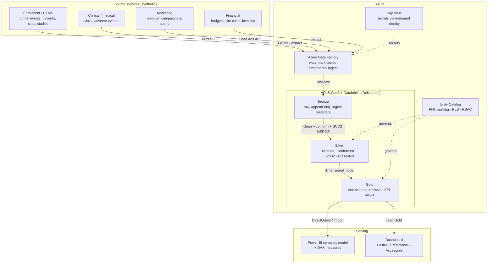

# Decentralized Trials BI Platform

An end-to-end data engineering and BI platform for a decentralized clinical research
organization, **built around one mission: making clinical trials faster, more predictable, and
more accessible.** Every layer of this platform exists to serve those three goals, and the Gold
marts and dashboard are organized by them.

The platform ingests the four data domains a decentralized research org actually runs on —
enrollment/recruitment, clinical/medical, marketing, and financial — lands them in an Azure Data
Lake, builds a medallion (Bronze → Silver → Gold) model in Databricks with SQL, governs PHI with
Unity Catalog, and serves leadership KPIs through a Power BI semantic model and a runnable
dashboard.

> Stack: **Azure** (ADLS Gen2, Data Factory, Key Vault, Databricks) · **Databricks + Delta Lake** ·
> **SQL-first transformations** · **Python** (ingestion + synthetic data) · **Bicep** IaC ·
> **Power BI** + a local dashboard · **GitHub Actions** CI.

---

## How the platform serves the mission

The Gold layer is split into three KPI domains that map one-to-one to the business goals:

| Mission goal | What the data answers | Gold KPI views |
|---|---|---|
| **Faster** | Where is time lost between first contact and an enrolled patient? | `kpi_speed` — enrollment velocity, time-to-first-patient, stage-to-stage cycle times, site activation lag |
| **More predictable** | Will this study hit its enrollment target, and when? | `kpi_predictability` — run-rate enrollment forecast, projected completion vs. target, funnel-conversion stability, at-risk flags |
| **More accessible** | Are we reaching more — and more representative — patients and communities? | `kpi_accessibility` — diversity/representation of enrolled patients, decentralized (community/mobile) reach, geographic spread |

A reviewer can run the whole thing locally with no Azure subscription and see these three views
populated end to end.

---

## Architecture



**New here for a review?** Start with [`PORTFOLIO.md`](PORTFOLIO.md) — the design decisions and why.

See [`docs/architecture.md`](docs/architecture.md) for layer-by-layer detail and
[`docs/lineage.md`](docs/lineage.md) for column lineage.

---

## Quick start (local mode — no Azure required)

```bash
python -m venv .venv && source .venv/bin/activate
pip install -r requirements.txt

make demo        # generate synthetic data -> Bronze -> Silver -> Gold -> launch dashboard
```

Or step by step:

```bash
make generate    # write synthetic source extracts to data/landing/
make run         # build Bronze, Silver, Gold (Parquet) via the local DuckDB runner
make test        # run data-quality tests against Gold
make dashboard   # launch the Streamlit dashboard on http://localhost:8501
```

Local mode runs the **same modeling logic** as the cloud path using DuckDB + Parquet so the
medallion and the three mission KPI domains are demonstrable on any laptop. The production
patterns — Spark/Delta, SCD Type 2 `MERGE`, and watermark CDC — live in the Databricks notebooks
and `sql/`.

## Deploy to Azure (real subscription)

> Deploying with **Claude Code / Cursor**? The agent auto-reads [`CLAUDE.md`](CLAUDE.md), a phase-by-phase Azure deployment runbook with cost/secret guardrails and stop-and-confirm points.

```bash
az login
az account set --subscription "<YOUR_SUBSCRIPTION_ID>"
cp infra/main.parameters.example.bicepparam infra/main.parameters.bicepparam   # fill in values
./scripts/deploy.sh        # subscription-scoped: creates RG + ADLS, Key Vault, ADF, Databricks
./scripts/post_deploy.sh   # seed Key Vault, wire ADF linked services/triggers
# ... demo ...
./scripts/teardown.sh      # deletes the resource group so nothing keeps billing
```

You can also deploy from GitHub Actions using **OIDC (no stored secrets)** — see [`docs/CICD_OIDC.md`](docs/CICD_OIDC.md). The Subscription ID is supplied at deploy time and never committed. Cost is controlled with small
SKUs and an auto-terminating Databricks cluster — see [`docs/COST.md`](docs/COST.md).

---

## Repository layout

```
infra/        Bicep IaC (subscription-scoped) + modules + example parameters
adf/          Azure Data Factory pipelines, datasets, linked services (ARM JSON)
src/          Python: synthetic generators, ingestion connectors, local medallion runner
notebooks/    Databricks notebooks: bronze / silver / gold (PySpark + Spark SQL)
sql/          Canonical Databricks SQL: Silver (SCD2 MERGE) and Gold (star schema + KPI views)
bi/           Power BI semantic model + DAX, and the runnable dashboard
tests/        Data-quality tests (pytest + DuckDB assertions)
docs/         Architecture, data dictionary, lineage, HIPAA notes, cost
scripts/      deploy / post_deploy / teardown
```

## Notes

- All data is **fully synthetic**. There is no real PHI anywhere in this repo.
- No company name is used; this is a generic decentralized-research-org reference implementation.
- HIPAA / PHI governance approach is documented in [`docs/HIPAA_NOTES.md`](docs/HIPAA_NOTES.md).
