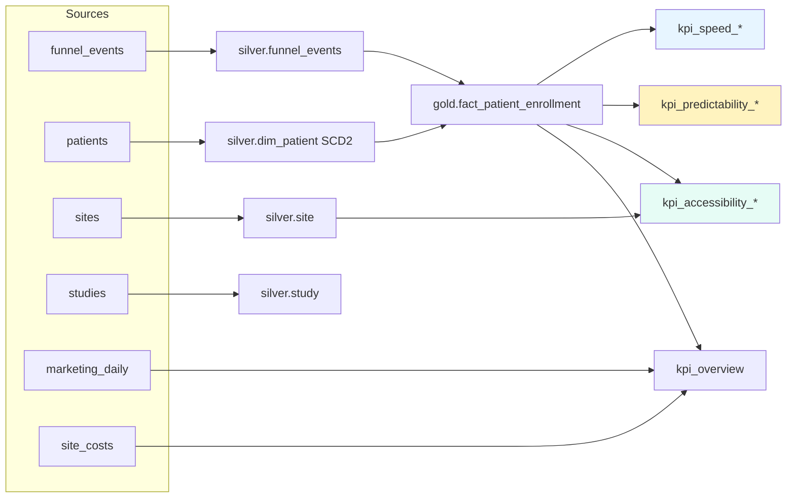

# Lineage

```mermaid
flowchart LR
    subgraph Sources
      FE[funnel_events]:::s
      PA[patients]:::s
      SI[sites]:::s
      ST[studies]:::s
      MK[marketing_daily]:::s
      SC[site_costs]:::s
    end
    FE --> svF[silver.funnel_events]
    PA --> svP[silver.dim_patient SCD2]
    SI --> svS[silver.site]
    ST --> svST[silver.study]

    svF --> FPE[gold.fact_patient_enrollment]
    svP --> FPE
    FPE --> SPD[kpi_speed_*]:::f
    FPE --> PRD[kpi_predictability_*]:::p
    FPE --> ACC[kpi_accessibility_*]:::a
    MK --> OV[kpi_overview]
    SC --> OV
    FPE --> OV
    svS --> ACC

    classDef s fill:#eef;
    classDef f fill:#e7f5ff;
    classDef p fill:#fff3bf;
    classDef a fill:#e6fcf5;
```

Faster = `kpi_speed_*` · Predictable = `kpi_predictability_*` · Accessible = `kpi_accessibility_*`.
